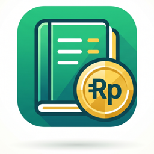

# 💰 Catat Uang - Offline-First Personal Finance App

<p align="center">
  
</p>

<p align="center">
  <b>Aplikasi Manajemen Keuangan Pribadi yang Cepat, Aman, Modern, dan 100% Offline-First.</b><br>
  Dibuat dengan <b>Flutter</b>, <b>Riverpod</b>, dan <b>Isar Database</b> berperforma tinggi.
</p>

<p align="center">
  
  
  
  
  
  
</p>

---

## 🌟 Fitur Utama

### 1. 📊 Dashboard & Arus Kas Realtime
- Ringkasan total saldo, pemasukan bulanan, dan pengeluaran bulanan.
- Indikator arus kas (*Cash Flow Indicator*) dengan visualisasi persentase pengeluaran vs pemasukan.
- Daftar transaksi terbaru (*Recent Transactions*) dan quick action untuk mencatat pengeluaran, pemasukan, atau transfer.

### 2. 💸 Transaksi & Transfer Multi-Dompet
- **Pemasukan & Pengeluaran**: Pencatatan cepat dengan pilihan kategori dinamis dan pemilihan dompet sumber.
- **Mekanisme Transfer 3-Transaksi**:
  - `TRANSFER_OUT` (pemotongan dompet asal)
  - `TRANSFER_IN` (penambahan dompet tujuan)
  - `EXPENSE` (biaya admin transfer otomatis tercatat & terhubung dalam 1 `transactionGroupId`).
- **Pola Reversal ACID**: Pengeditan & penghapusan transaksi selalu mengembalikan saldo dompet secara akurat sebelum menerapkan perubahan baru.

### 3. 🎯 Target Tabungan (Savings Goals)
- Sistem tabungan berbasis **Virtual Wallet** (`isGoal`) untuk menjaga akurasi total kekayaan bersih (*Net Worth*).
- Menabung dan tarik tabungan via mekanisme transfer antar dompet.
- Visualisasi persentase progres target dan perkiraan waktu tercapai.

### 4. 🤝 Manajemen Utang & Piutang (Debt & Receivable)
- Catat pinjaman yang harus dibayar (*Payable*) dan tagihan yang harus diterima (*Receivable*).
- Integrasi buku kontak (*Contact List*) dan batas tanggal jatuh tempo (*Due Date*).
- Pembayaran cicilan / pelunasan bertahap yang otomatis mencatat transaksi dan menyesuaikan saldo dompet serta sisa tagihan.

### 5. 🎯 Anggaran Bulanan (Budgeting)
- Alokasi batas maksimal pengeluaran per kategori.
- Peringatan status anggaran pintar:
  - 🟢 **Aman**: Penggunaan < 75%
  - 🟡 **Peringatan**: Penggunaan 75% - 99%
  - 🔴 **Overbudget**: Penggunaan ≥ 100%

### 6. 📈 Laporan Keuangan & Ekspor Data
- Analisis pengeluaran per kategori dalam bentuk diagram lingkaran interaktif (*Pie Chart* dari `fl_chart`).
- **Ekspor PDF Resmi**: Laporan keuangan bulanan terformat rapi siap cetak/simpan.
- **Ekspor CSV (Excel / Spreadsheet)**: Format standar RFC 4180 dengan UTF-8 BOM untuk kompatibilitas Microsoft Excel.

### 7. 🔒 Keamanan & Tutup Buku (Period Locking)
- **Tutup Buku (*Locked Period*)**: Proteksi data historis dari perubahan tidak sengaja setelah periode tertentu dikunci.
- **Privacy Screen Wrapper**: Tampilan otomatis disamarkan (*blur/overlay*) saat aplikasi berada di *App Switcher / Background* untuk melindungi privasi saldo finansial.

---

## 🏛️ Arsitektur Proyek (Feature-First)

Aplikasi dibangun mengikuti prinsip **Feature-First Architecture** dan kaidah ACID pada layer Repository:

```
lib/
├── core/                       # Komponen inti global
│   ├── database/               # Isar Database Provider & Instance
│   ├── exceptions/             # Custom Error (misal: LockedPeriodException)
│   ├── presentation/           # MainNavigationScreen (IndexedStack BottomNav)
│   ├── routing/                # GoRouter config & redirect logic
│   ├── theme/                  # Desain tema, palet warna, tipografi
│   ├── utils/                  # CurrencyFormatter, DateFormatter
│   └── widgets/                # PrivacyScreenWrapper
│
└── features/                   # Modul fitur mandiri
    ├── budget/                 # Fitur Anggaran
    ├── category/               # Master Kategori (Income & Expense)
    ├── contact/                # Master Kontak Peminjam / Kreditur
    ├── dashboard/              # Dashboard & Analisis Cepat
    ├── debt/                   # Manajemen Utang & Piutang
    ├── goal/                   # Target Tabungan (Virtual Wallets)
    ├── onboarding/             # Panduan Awal & Setup Dompet Pertama
    ├── report/                 # Laporan Bulanan & Ekspor PDF/CSV
    ├── search/                 # Pencarian Global Transaksi & Catatan
    ├── settings/               # Tutup Buku, Reset Data, Profil
    ├── splash/                 # Splash Screen Animasi & Routing Inisial
    ├── transaction/            # ACID Repository & Transaksi Keuangan
    └── wallet/                 # Dompet Keuangan (Bank, E-Wallet, Cash)
```

Tiap fitur dibagi menjadi sub-layer yang terisolasi dengan rapi:
- `domain/`: Skema entitas `@Collection` Isar.
- `data/`: Repository untuk query Isar, transaksi ACID, dan aturan bisnis.
- `application/`: Riverpod Providers (`StreamProvider`, `StateNotifier`).
- `presentation/`: UI Widgets & Screens.

---

## 🚀 Memulai (Getting Started)

### Prasyarat:
- [Flutter SDK](https://docs.flutter.dev/get-started/install) (versi 3.22.0 atau lebih baru)
- Dart SDK 3.4+

### Langkah Instalasi:

1. **Clone Repository:**
   ```bash
   git clone https://github.com/username/catatuang.git
   cd catatuang
   ```

2. **Pasang Dependensi:**
   ```bash
   flutter pub get
   ```

3. **Generate Kode Isar (Opsional jika mengubah skema):**
   ```bash
   dart run build_runner build --delete-conflicting-outputs
   ```

4. **Jalankan Aplikasi:**
   ```bash
   flutter run
   ```

---

## 🧪 Menjalankan Automated Tests

Aplikasi dilengkapi dengan rangkaian pengujian komprehensif (Unit Test, Widget Test, dan Multithreading Safety):

```bash
# Menjalankan static analyzer
flutter analyze

# Menjalankan seluruh test suite (37 tests)
flutter test
```

---

## 🛠️ Tech Stack & Library Utama

| Kategori | Teknologi / Package |
|---|---|
| **Framework** | [Flutter](https://flutter.dev) |
| **State Management** | [Flutter Riverpod](https://pub.dev/packages/flutter_riverpod) |
| **Local Database** | [Isar Database](https://pub.dev/packages/isar) |
| **Routing** | [GoRouter](https://pub.dev/packages/go_router) |
| **Typography** | [Google Fonts](https://pub.dev/packages/google_fonts) (Manrope, Outfit, Hanken Grotesk) |
| **Charts** | [FL Chart](https://pub.dev/packages/fl_chart) |
| **Reporting & Export** | [pdf](https://pub.dev/packages/pdf), [printing](https://pub.dev/packages/printing), [file_saver](https://pub.dev/packages/file_saver) |
| **Localization** | [intl](https://pub.dev/packages/intl) (`id_ID`) |

---

<p align="center">
  Dibuat dengan ❤️ untuk manajemen keuangan pribadi yang lebih rapi, terukur, dan aman.
</p>
